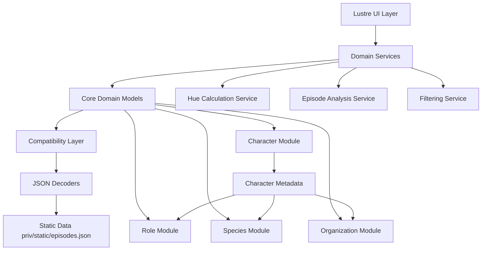
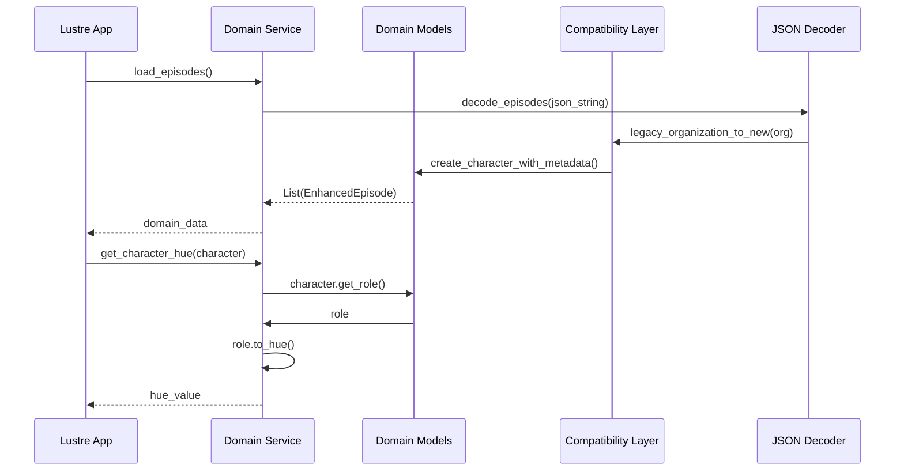
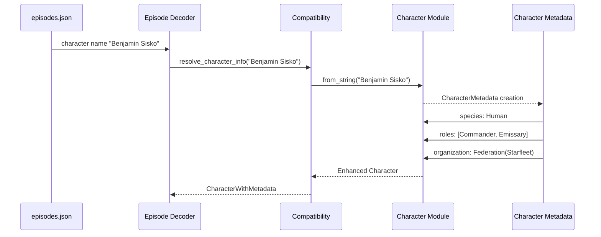
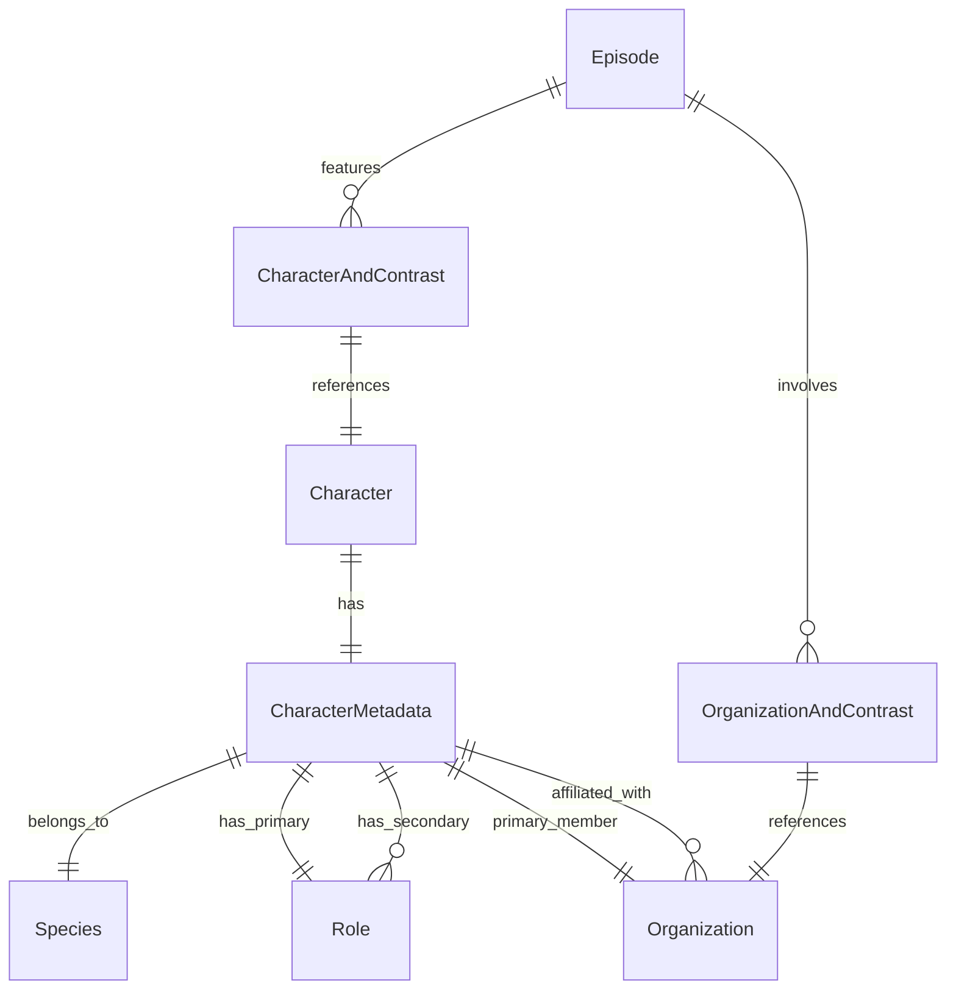
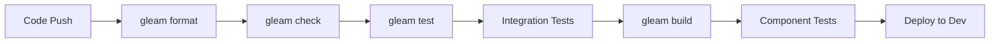

# 技術設計書

## Overview
Deep Space Nine RTAチャートアプリケーションのドメインモデル改善のための技術設計。現在の単純な列挙型から、Role、Species、拡張Character型を導入し、型変数を活用した組織・役職関係の表現により、型安全性と拡張性を向上させる。Gleam 1.11.1の Custom Types、Generic Types、Pattern Matching 機能を活用し、関数型プログラミングのベストプラクティスに従う。

## Requirements Mapping

### 設計コンポーネントの要件追跡
各設計コンポーネントは特定の要件に対応：
- **Role型システム** → REQ-1: 型安全な役職管理とhue値計算
- **Species型の導入** → REQ-2: 種族と組織概念の分離
- **拡張Character型** → REQ-3: メタデータの統合管理
- **Generic Organization型** → REQ-4: 型変数による組織・役職関係
- **互換性レイヤー** → REQ-5: 既存機能との後方互換性
- **拡張アーキテクチャ** → REQ-6: 将来の拡張性対応

### User Story カバレッジ
- **開発者ストーリー1**: Role型による型安全な役職管理 → Role型システムとhue計算で対応
- **開発者ストーリー2**: Species/Organization分離 → Species型とOrganization型再設計で対応
- **開発者ストーリー3**: Character型拡張 → CharacterMetadata型とアクセサ関数で対応
- **開発者ストーリー4**: 型変数による組織・役職関係 → Generic Organization型で対応
- **開発者ストーリー5**: 既存機能の後方互換性 → 互換性レイヤーで対応
- **開発者ストーリー6**: 将来の拡張性 → モジュラーアーキテクチャで対応

## Architecture

### 高レベルシステムアーキテクチャ



### 技術スタック
研究結果および要件分析に基づく：

- **言語**: Gleam (v1.11.1) - 型安全な関数型プログラミング言語
- **UI Framework**: Lustre (v5.2.1) - Elm-inspired reactive UI
- **JSON処理**: gleam_json (v3.0.2) - 型安全なJSON parsing
- **HTTP**: RSVP (v1.1.3) - Promise-based HTTP requests
- **テスト**: Gleeunit (v1.6.1) - Unit testing framework
- **ビルド**: Gleam compiler - JavaScript target

### アーキテクチャ決定の根拠
研究に基づく主要技術選択の理由：

- **Gleam Custom Types**: 2024年1.0.0リリースでプロダクション対応、ADTsによるドメインモデリングに最適
- **Generic Types**: 型変数による組織・役職関係表現に必要、Federation(role: StarfleetRole)形式を実現
- **Pattern Matching**: 網羅的パターンマッチングによる安全性確保、コンパイル時エラー検出
- **Immutable Data**: 関数型プログラミング原則に従い、副作用を排除して予測可能な動作を保証

## Data Flow

### 主要データフロー



### キャラクター拡張フロー



## コンポーネントと インターフェース

### ドメインモジュールとメソッドシグネチャ

#### Role Module (src/types/role.gleam)
```gleam
// Role型の定義
pub type Role {
  // Starfleet Roles
  StarfleetCommand
  StarfleetEngineering
  StarfleetSecurity
  StarfleetScience
  StarfleetMedical
  StarfleetOperations

  // Bajoran Roles
  BajoranMilitia
  BajoranReligious

  // Other Organizations
  CardassianMilitary
  KlingonWarrior
  FerengiCommerce
  DominionService

  // Special Roles
  ChangelingFounder
  VortaDiplomat
  JemHadarSoldier
}

// 公開関数
pub fn to_string(role: Role) -> String        // 表示名変換
pub fn from_string(s: String) -> Result(Role, String)  // 文字列解析
pub fn to_hue(role: Role) -> Int              // 色分け計算（既存ロジック継承）
```

#### Species Module (src/types/species.gleam)
```gleam
pub type Species {
  // Major Species
  Human
  Bajoran
  Cardassian
  Klingon
  Ferengi
  Trill
  Vulcan

  // Dominion Species
  Changeling
  Vorta
  JemHadar

  // Other Species
  Andorian
  Betazoid
  ElAurian
}

pub fn to_string(species: Species) -> String           // 表示名変換
pub fn from_string(s: String) -> Result(Species, String)  // 文字列解析
pub fn get_cultural_traits(species: Species) -> List(String)  // 文化的特徴（将来拡張用）
```

#### Enhanced Organization Module (src/types/organization.gleam)
```gleam
// Generic Organization型（型変数でRole制約）
pub type Organization(role) {
  Federation(member_role: role)
  CardassianUnion
  KlingonEmpire
  DominionForces(member_role: role)
  BajoranProvisionalGov(member_role: role)
  FerengiAlliance

  // 宗教・文化組織
  BajoranReligion
  ProphetsTemple
  TrillSymbiosisCommission

  // 特殊組織
  Maquis
  MirrorUniverse

  // 独立
  Independent
}

pub fn to_string(org: Organization(role)) -> String        // 表示名変換
pub fn from_string(s: String) -> Result(Organization(String), String)  // 文字列解析（互換性用）
pub fn to_hue(org: Organization(role)) -> Int              // 色分け計算
```

#### Enhanced Character Module (src/types/character.gleam)
```gleam
// 拡張Character型（メタデータ付き）
pub type Character {
  BenjaminSisko
  JakeSisko
  Dax
  KiraNerys
  MilesObrien
  KeikoObrien
  Bashir
  Odo
  Worf
  Quark
  Rom
  Nog
  Winn
  Bareil
  Garak
  Dukat
  // ... その他既存キャラクター
}

// キャラクターメタデータ
pub type CharacterMetadata {
  CharacterMetadata(
    character: Character,
    species: Species,
    organization: Organization(Role)
  )
}

// 互換性維持の公開関数
pub fn to_string(character: Character) -> String                    // 既存互換
pub fn from_string(s: String) -> Result(Character, String)         // 既存互換
pub fn image_hue(character: Character) -> Int                      // 既存互換（内部でメタデータ使用）

// 新機能の公開関数
pub fn get_metadata(character: Character) -> CharacterMetadata     // メタデータ取得
pub fn get_species(character: Character) -> Species                // 種族取得
pub fn get_role(character: Character) -> Role                      // 役職取得
pub fn get_organization(character: Character) -> Organization(Role)  // 所属組織取得
```

### UIコンポーネント
| コンポーネント名 | 責任 | Props/State概要 |
|------------------|------|-----------------|
| episode_table    | エピソード表示テーブル | episodes: List(Episode), sort_key: SortKey |
| histogram        | キャラクター/組織ヒストグラム | data: List(SeasonImportance), title: String, hue: Int |
| character_filter | キャラクターフィルタリング | characters: List(Character), selected: Set(Character) |

### 互換性API

既存の公開インターフェースを維持：

| 関数 | 引数 | 戻り値 | 互換性 |
|------|------|--------|--------|
| character.to_string | Character | String | 完全互換 |
| character.from_string | String | Result(Character, String) | 完全互換 |
| character.image_hue | Character | Int | 完全互換（内部実装変更） |
| organization.to_string | Organization | String | 完全互換 |
| organization.from_string | String | Result(Organization, String) | 完全互換 |

## データモデル

### ドメインエンティティ

1. **Character**: キャラクター識別子（列挙型、既存互換）
2. **CharacterMetadata**: キャラクターの詳細情報（種族、役職、所属）
3. **Role**: 役職・階級の型安全表現（組織別階層構造）
4. **Species**: 種族分類（組織から分離）
5. **Organization**: 組織・団体（Generic型で役職制約）
6. **Episode**: エピソード情報（既存構造維持）

### エンティティ関係



### データモデル定義

#### CharacterMetadata構造 (Gleam)
```gleam
pub type CharacterMetadata {
  CharacterMetadata(
    character: Character,
    species: Species,
    organization: Organization(Role)
  )
}

// メタデータマップ（各キャラクターの詳細情報）
pub const character_metadata_map: dict.Dict(Character, CharacterMetadata)
```

#### 設定例：主要キャラクター
```gleam
// Benjamin Sisko
CharacterMetadata(
  character: BenjaminSisko,
  species: Human,
  organization: Federation(StarfleetCommand(Commander))
)

// Kira Nerys
CharacterMetadata(
  character: KiraNerys,
  species: Bajoran,
  primary_organization: BajoranProvisionalGov(BajoranMilitia(Major)),
)
```

### マイグレーション戦略
- **段階的導入**: 既存Character型を維持しながらCharacterMetadata追加
- **後方互換性**: 全ての既存公開関数のシグネチャを保持
- **データ変換**: JSONデコード時に既存形式から新形式への自動マッピング
- **インデックス戦略**: メタデータマップによる高速アクセス

## エラーハンドリング

### 包括的エラーハンドリング戦略

#### カスタムエラー型の拡張
```gleam
// 既存AppError型の拡張
pub type AppError {
  // 既存エラー（互換性維持）
  UnknownCharacterError(String)
  UnknownOrganizationError(String)

  // 新しいドメインモデル用エラー
  UnknownSpeciesError(String)
  UnknownRoleError(String)
  InvalidOrganizationRoleCombination(String, String)
  MetadataNotFoundError(Character)

  // 型変数関連エラー
  RoleOrganizationMismatchError(Role, String)
  GenericTypeConstraintError(String)

  // JSON処理エラー
  LegacyDataMappingError(String)
  MetadataDecodingError(String)
}
```

#### エラーハンドリングパターン
```gleam
// Result型を活用した安全な型変換
pub fn create_character_with_role(
  character: Character,
  role_str: String
) -> Result(CharacterMetadata, AppError) {
  use role <- result.try(role.from_string(role_str))
  use metadata <- result.try(character.get_metadata(character))

  // 組織・役職の妥当性検証
  case validate_role_organization_match(role, metadata.organization) {
    True -> Ok(CharacterMetadata(..metadata, role: role))
    False -> Error(RoleOrganizationMismatchError(role, metadata.organization))
  }
}
```

## セキュリティ考慮事項

### データ保護
- **入力検証**: 文字列からのドメイン型変換時の厳密な検証
- **型安全性**: Gleamの強い型システムによる不正データの排除
- **パターンマッチング**: 網羅的パターンマッチングによる予期しない値の処理

### 型レベルセキュリティ
```gleam
// 組織・役職の型制約による不正組み合わせ防止
pub fn assign_role_to_organization(
  character: Character,
  role: role,
  org: Organization(role)
) -> Result(CharacterMetadata, AppError) {
  // 型システムが自動的に無効な組み合わせを防ぐ
  // 例: StarfleetRankをCardassianUnionに割り当て不可
}
```

### セキュリティベストプラクティス
- **不変性**: イミュータブルデータ構造による副作用の排除
- **純粋関数**: 副作用のない関数設計による予測可能な動作
- **コンパイル時検査**: Gleamの型チェッカーによる実行時エラーの予防

## パフォーマンス & スケーラビリティ

### パフォーマンス目標
| メトリック | 目標 | 測定方法 |
|-----------|------|----------|
| キャラクターメタデータ取得 (p95) | < 1ms | 関数実行時間 |
| エピソード解析 (p95) | < 10ms | episode解析処理 |
| ヒストグラム描画 (p95) | < 50ms | UIレンダリング時間 |
| JSON解析 (p99) | < 100ms | episodes.json読み込み |
| メモリ使用量 | < 50MB | ブラウザメモリ消費 |

### キャッシュ戦略
- **メタデータマップ**: 静的CharacterMetadataマップによる高速アクセス
- **計算結果キャッシュ**: hue値計算結果のメモ化
- **ブラウザキャッシュ**: 静的JSON data の長期キャッシュ

### スケーラビリティアプローチ
- **関数型設計**: イミュータブルデータによる並行処理安全性
- **モジュラー構造**: 独立したドメインモジュールによる保守性
- **型安全性**: コンパイル時エラー検出による実行時オーバーヘッド削減

## テスト戦略

### テストカバレッジ要件
- **Unit Tests**: ≥90% code coverage (ドメインロジック重視)
- **Integration Tests**: 全てのJSON解析と互換性変換
- **Property-based Tests**: 型変数制約の検証
- **Regression Tests**: 既存機能の後方互換性

### テストアプローチ

#### 1. 単体テスト
```gleam
// Role型のテスト例
pub fn role_to_hue_test() {
  let commander_role = StarfleetCommand(Commander)
  let hue = role.to_hue(commander_role)
  should.equal(hue, 350)  // command色
}

pub fn invalid_role_parsing_test() {
  let result = role.from_string("InvalidRole")
  should.be_error(result)
}
```

#### 2. 統合テスト
```gleam
// Character-Role-Organization統合テスト
pub fn sisko_metadata_integration_test() {
  let metadata = character.get_metadata(BenjaminSisko)
  should.equal(metadata.species, Human)
  should.equal(metadata.role, StarfleetCommand(Commander))
}
```

#### 3. Property-based テスト
```gleam
// 型変数制約のproperty-based testing
pub fn organization_role_consistency_property() {
  // 全てのCharacterについて、organizationが一致することを検証
  property.for_all(character_generator(), fn(char) {
    let metadata = character.get_metadata(char)
    validate_role_organization_match(
      metadata.organization
    )
  })
}
```

#### 4. 後方互換性テスト
```gleam
// 既存API互換性テスト
pub fn legacy_api_compatibility_test() {
  // 既存のto_string, from_string, image_hue関数が同じ結果を返すことを検証
  let character = BenjaminSisko
  let old_hue = legacy_image_hue(character)  // 既存実装
  let new_hue = character.image_hue(character)  // 新実装
  should.equal(old_hue, new_hue)
}
```

### CI/CD Pipeline



### テスト環境設定
- **単体テスト**: Gleeunit framework
- **Property テスト**: Gleam property-based testing library
- **統合テスト**: 実際のepisodes.jsonを使用した完全なデータフロー検証
- **パフォーマンステスト**: ブラウザでの実行時間測定
